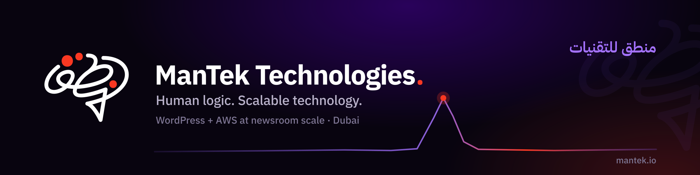

<div align="center">

<a href="https://www.mantek.io"></a>

# ManTek Technologies

### Human logic. Scalable technology.

Full-stack WordPress & web engineering, with **WordPress + AWS** at scale.

[Website](https://www.mantek.io) · [Insights](https://www.mantek.io/insights) · [Contact](https://www.mantek.io/contact) · [LinkedIn](https://www.linkedin.com/company/mantekio) · [Packagist](https://packagist.org/packages/mantekio/)

</div>

---

### About

We're a Dubai-based engineering studio building and running media-grade websites and publishing platforms. The name is **hu·MAN + TEK·nologies**, and it echoes the Arabic منطق (*man·tiq*): "logic."

We specialise in **WordPress engineering**, and where a site has to hold national-scale traffic, **WordPress + AWS**. We've run the digital platforms of a leading pan-Arab newsroom in production for years (load-tested to **50,000** concurrent readers, absorbing **20×** traffic spikes with no spike-driven outages), and that experience is the backbone of everything we build.

### What we do

- **WordPress & web engineering**: sites and systems built to stay fast, secure, and maintainable for years.
- **WordPress + AWS at scale**: CloudFront, S3, Lambda and SES/SNS in front of WordPress, so the newsroom stays simple while delivery absorbs the load.
- **Hosting, domains, DNS & email · security & maintenance**: the full operational layer, run properly.
- **NUZ**: our cloud-native publishing platform for high-traffic newsrooms.

### Open source

Every plugin here came out of a problem we hit in production, and every one is paired with the write-up that explains it. Read the article to understand the failure, install the plugin to fix it.

| Plugin | The problem it solves | The write-up |
|---|---|---|
| **[wp-arabic-search](https://github.com/mantekio/wp-arabic-search)** | WordPress compares Arabic byte for byte, so one word spelled two ways never matches. On a real archive that meant 1 result where there were 28,238. | [Arabic search in WordPress: the matches it silently misses](https://www.mantek.io/insights/wordpress-arabic-search) |
| **[wp-arabic-slug-schema-guard](https://github.com/mantekio/wp-arabic-slug-schema-guard)** | A routine core update silently truncates long Arabic URLs, and by the time the 404s appear the data is gone. | [The 200-byte trap: why WordPress core updates break Arabic URLs](https://www.mantek.io/insights/wordpress-arabic-slug-truncation) |
| **[wp-edge-images](https://github.com/mantekio/wp-edge-images)** | Every image size is generated on upload, instead of served on the fly from the edge. | [Make WordPress do less: offloading media to S3 and the edge](https://www.mantek.io/insights/wordpress-s3-media-pipeline) |
| **[wp-fleet-cron](https://github.com/mantekio/wp-fleet-cron)** | Behind a load balancer, wp-cron silently misses schedule. | [WordPress cron behind a load balancer: fixing 'Missed schedule'](https://www.mantek.io/insights/wordpress-cron-load-balancer) |
| **[wp-ses-mail](https://github.com/mantekio/wp-ses-mail)** | WordPress reports the mail as sent when it never left the server. | [Your WordPress says the email sent. It didn't.](https://www.mantek.io/insights/wordpress-email-ses) |

All GPL-2.0, all must-use plugins, all on Packagist under `mantekio/`:

```bash
composer require mantekio/wp-arabic-search
```

Two of the five exist only because **Arabic breaks WordPress in ways English never surfaces**. That is not a niche problem: it is most of the web's right-to-left traffic, and almost nobody upstream is testing for it.

Client work and our production architecture stay private. The generically useful parts live here.

### Also here

**[syria-government-design-system](https://github.com/mantekio/syria-government-design-system)** is not code. It is an independent analysis, in English and Arabic, of how a national government design system for Syria could be built, benchmarked against fourteen international government design systems. Published under CC BY 4.0 as the companion to [the write-up of the same name](https://www.mantek.io/insights/syria-government-design-system). Not affiliated with, authorised by, or endorsed by the Syrian government.

### Writing

We publish engineering deep-dives (WordPress at scale, AWS architecture, and the hard-won lessons of keeping newsrooms online) at **[mantek.io/insights](https://www.mantek.io/insights)**, in English and Arabic.

### Work with us

Building something that has to stay fast and online when it matters most? **[Let's talk →](https://www.mantek.io/contact)**

<div align="center">

Dubai, U.A.E. · [info@mantek.io](mailto:info@mantek.io)

</div>
